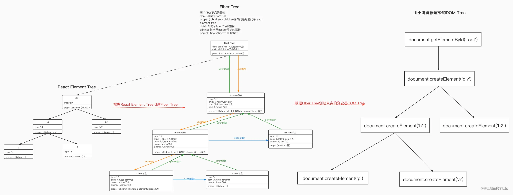

# Build Your Own React

## STEP 0
我们可以用三行代码使用React app
```tsx
const element = <h1 title="foo">Hello</h1>
const container = document.getElementById("root")
ReactDOM.render(element, container)
```
由类似babel一样的构建工具转化成普通js的，这样的转化通常比较简单：将标签内的代码替换为对 createElement 的调用，将标签名称、props和子元素作为参数传递。

```tsx
const element = <h1 title="foo">Hello</h1>

// 将会被转化成
const element = React.createElement(
  "h1",
  { title: "foo" },
  "Hello"
)
```
最终element长这样：
```tsx
const element = {
  type: "h1",
  props: {
    title: "foo",
    children: "Hello",
  },
}
```
所以我们使用原生 js 来实现前面的三行：
```tsx
const element = {
  type: "h1",
  props: {
    title: "foo",
    children: "Hello",
  },
}

const container = document.getElementById("root")

const node = document.createElement(element.type)
node["title"] = element.props.title

const text = document.createTextNode("")
text["nodeValue"] = element.props.children

node.appendChild(text)
container.appendChild(node)
```

## STEP 1：实现 createElement 函数
```tsx
function createElement(type, props, ...children) {
  return {
    type,
    props: {
      ...props,
      children: children.map(child =>
        typeof child === "object"
          ? child
          : createTextElement(child)
      ),
    },
  }
}

// 用来创建文字类型
function createTextElement(text) {
  return {
    type: "TEXT_ELEMENT",
    props: {
      nodeValue: text,
      children: [],
    },
  }
}

const Didact = {
  createElement,
}


Didact.createElement("div", null, a, b)
```
* 总结：createElement 函数是把元素配置返回成 json，方便下一步调用。

## STEP 2：实现 render 函数

**render函数的作用是创建dom，append到container**
```tsx
function render(element, container) {
  // 创建dom
  // 兼容text
  const dom =
    element.type == "TEXT_ELEMENT"
      ? document.createTextNode("")
      : document.createElement(element.type)

// 配置元素属性
const isProperty = key => key !== "children"
  Object.keys(element.props)
    .filter(isProperty)
    .forEach(name => {
      dom[name] = element.props[name]
    })
 
 // 递归处理子元素
 element.props.children.forEach(child =>
    render(child, dom)
  )

  // append到节点    
  container.appendChild(dom)
}

const Didact = {
  createElement,
  render,
}
```

render 函数递归创建真实的 dom 元素，然后将各个元素 append 到其父元素中，最后整个 dom 树 append 到 root
container 中，渲染完成，**这个过程一旦开始，中间是无法打断的，直到整个应用渲染完成。** 这也是 React16 版本以前的渲染过程

注意，只有当整个dom树append到root container中时，页面才会显示

## STEP 3：实现 Concurrent Mode（并发模式）
React16以后， rendering 是可以被中断的。

render 函数是递归构建 dom 树，最后才 append 到 root container，最终页面才渲染出来。这里有个问题，如果 dom 节点数量庞大，递归层级过深，这个过程其实是很耗时的，导致 render 函数长时间占用主线程，浏览器无法响应用户输入等事件，造成卡顿的现象。

因此我们需要将 render 过程拆分成小的任务单元，每执行完一个单元，都允许浏览器打断 render 过程并执行高优先级的任务，等浏览器得空再继续执行 render 过程。

真实React代码中没有使用 requestIdleCallback 这个api，因为有兼容性问题。因此React使用 scheduler package 模拟这个调度过程

简单介绍 requestIdleCallback
1. 使用方法：requestIdleCallback(callback,[options])
2. callback 函数会接受一个 IdleDeadline 参数，该参数有一个 IdleDeadline.timeRemaining() 方法，当返回值是浮点数值。它用来表示当前闲置周期的预估剩余毫秒数。如果 idle period 已经结束，则它的值是0。

```tsx
let nextUnitOfWork = null

// 开始执行
requestIdleCallback(workLoop)

function workLoop(deadline) {
  let shouldYield = false
  
  // 有下一个任务并且还有空闲
  while (nextUnitOfWork && !shouldYield) {
    // performUnitOfWork 会在执行完之后返回下一个任务的引用
    nextUnitOfWork = performUnitOfWork(
      nextUnitOfWork
    )
    // 判断有无空闲，当还有空闲时间时，继续执行，没有的话跳出循环
    shouldYield = deadline.timeRemaining() < 1
  }
  
  // 跳出循环后，在下一个空闲继续执行任务，直到任务执行完毕
  requestIdleCallback(workLoop)
}


function performUnitOfWork(nextUnitOfWork) {
  // do something
}
```
performUnitOfWork 接受当前的工作单元。**工作单元可以理解为就是一个 fiber 节点**

workLoop 循环里会循环调用 performUnitOfWork，直到工作单元都已处理完毕，或者当前帧浏览器已经没有空闲时间，则循环终止。等下次浏览器空闲时间再接着继续执行

**因此我们需要一种数据结构，能够支持任务打断并且可以接着继续执行，很显然，链表就非常适合**

## STEP 4：Fibers

### 介绍

Fibers 就是一种数据结构，支持将渲染过程拆分成工作单元，本质上就是一个双向链表。这种数据结构的好处就是方便找到下一个工作单元

Fiber 包含三层含义：
* 作为架构来说，之前 React 15 的 Reconciler 采用递归的方式执行，数据保存在递归调用栈中，所以被称为 Stack Reconciler。React 16 的 Reconciler 基于 Fiber 节点实现，则被称为 Fiber Reconciler
* 作为静态的数据结构来说，每个 Fiber 节点对应一个 React Element，保存了该组件的类型（函数组件/类组件/html标签）、对应的 DOM 节点信息等
* 作为动态的工作单元来说，每个 Fiber 节点保存了本次更新中该组件改变的状态、要执行的工作等

Fiber的几点冷知识：
* 一个 Fiber 节点对应一个React Element节点，同时也是一个工作单元
* 每个 fiber 节点都有指向第一个子元素，下一个兄弟元素，父元素的指针

以下面代码为例：
```tsx
MyReact.render(
  <div>
    <h1>
      <p />
      <a />
    </h1>
    <h2 />
  </div>,
  container
)
```
对应的 fiber tree 如下：<br/>
<br/>
我们要实现一种用来实现虚拟 dom 的数据结构，能实现3件事情
* add the element to the DOM
* create the fibers for the element's children
* select the next unit of work

所以必须有三类节点
* 能找到下一个单元
* 能找到下一个兄弟节点
* 能找到父节点

首先把 render 的创建 dom 函数单独抽取出来
```tsx
function createDom(fiber) {
  const dom =
    fiber.type == "TEXT_ELEMENT"
      ? document.createTextNode("")
      : document.createElement(fiber.type)

  const isProperty = key => key !== "children"
  Object.keys(fiber.props)
    .filter(isProperty)
    .forEach(name => {
      dom[name] = fiber.props[name]
    })

  return dom
}
```
在 render 函数中设置 nextUnitOfWork
```tsx
function render(element, container) {
  nextUnitOfWork = {
    dom: container,
    props: {
      children: [element],
    },
  }
  // ....
}

let nextUnitOfWork = null

function workLoop(deadline) {
  let shouldYield = false
  while (nextUnitOfWork && !shouldYield) {
    nextUnitOfWork = performUnitOfWork(
      nextUnitOfWork
    )
    shouldYield = deadline.timeRemaining() < 1
  }
  requestIdleCallback(workLoop)
}
​
requestIdleCallback(workLoop)
```
实现 performUnitOfWork。这个函数就是构建 fiber 的基本实现
```tsx
// performUnitOfWork函数主要逻辑：
//   将element元素添加到DOM
//   给element的子元素创建对应的fiber节点
//   返回下一个工作单元，即下一个fiber节点，查找过程：
//      1.如果有子元素，则返回子元素的fiber节点
//      2.如果没有子元素，则返回兄弟元素的fiber节点
//      3.如果既没有子元素又没有兄弟元素，则往上查找其父节点的兄弟元素的fiber节点
//      4.如果往上查找到root fiber节点，说明render过程已经结束
function performUnitOfWork(fiber) {
  // 第一步 根据fiber节点创建真实的dom节点，并保存在fiber.dom属性中
  if(!fiber.dom){
    fiber.dom = createDom(fiber)
  }
  // 第二步 将当前fiber节点的真实dom添加到父节点中，注意，这一步是会触发浏览器回流重绘的！！！
  if(fiber.parent){
    fiber.parent.dom.appendChild(fiber.dom)
  }
  // 第三步 给子元素创建对应的fiber节点
  const children = fiber.props.children
  let prevSibling
  children.forEach((child, index) => {
    const newFiber = {
      type: child.type,
      props: child.props,
      parent: fiber,
      dom: null
    }
    if(index === 0){
      fiber.child = newFiber
    } else {
      prevSibling.sibling = newFiber
    }
    prevSibling = newFiber
  })
  // 第四步，查找下一个工作单元
  if(fiber.child){
    return fiber.child
  }
  let nextFiber = fiber
  while(nextFiber){
    if(nextFiber.sibling){
      return nextFiber.sibling
    }
    nextFiber = nextFiber.parent
  }
 
}
```
这里有一点值得细品，React.createElement 返回的 **element tree** 和 performUnitOfWork 创建的 **fiber tree** 有什么联系？

* **React Element Tree** 是由 **React.createElement** 方法创建的树形结构对象
* **Fiber Tree** 是根据 **React Element Tree** 创建来的树。每个 Fiber 节点保存着真是的 DOM 节点，并且保存着对 **React Element Tree** 中对应的 Element 节点的应用。注意，Element 节点并不会保存对 Fiber 节点的应用<br/>
<br/>