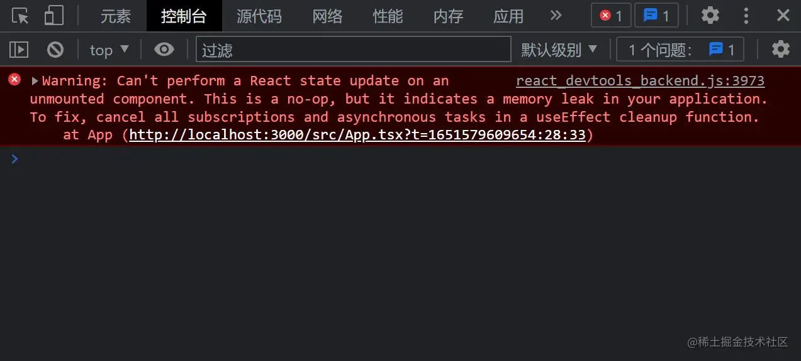

# React18 分享

### 分享内容：
#### 1. React18 背景
#### 2. 升级指南
#### 3. React18（新特性、新API、并发模式）

## React18 背景
Reac17 中只有三个小版本，分别是17.0.0、17.0.1、17.0.2。只更新了补丁号，并且都是一些比较细节的更新、优化。

在 2021 年 6 月份，React 18 Working Group（React 18 工作组，简称 reactwg）成立了，并且公布了 v18 版本的发布计划，经过将近一年的迭代和准备，在 2022 年 3 月 29 日，React 18 正式版发布。

## 升级指南
* 新项目： 直接用 npm 或者 yarn 安装最新版依赖即可
```bash
npm i react react-dom --save
    
npm i @types/react @types/react-dom -D
```

* 老项目：先把依赖中的版本号改成最新，然后删掉 node_modules 文件夹，重新安装
```bash
npm i 
```

## 新特性
### 一、Render API
为了更好的管理root节点，React 18 引入了一个新的 root API，新的 root API 还支持 new concurrent renderer（并发模式的渲染），它允许你进入concurrent mode（并发模式）
```tsx
// React 17
import React from 'react';
import ReactDOM from 'react-dom';
import App from './App';

const root = document.getElementById('root')!;

ReactDOM.render(<App />, root);

// React 18
import React from 'react';
import ReactDOM from 'react-dom/client';
import App from './App';

const root = document.getElementById('root')!;

ReactDOM.createRoot(root).render(<App />);
```
同时，在卸载组件时，我们也需要将 unmountComponentAtNode 升级为 root.unmount:
```tsx
// React 17
ReactDOM.unmountComponentAtNode(root);

// React 18
root.unmount();
```

除此之外，React 18 还从 render 方法中删除了回调函数，因为当使用Suspense时，它通常不会有预期的结果。

在新版本中，如果需要在 render 方法中使用回调函数，我们可以在组件中通过 useEffect 实现：
```tsx
// React 17
const root = document.getElementById('root')!;
ReactDOM.render(<App />, root, () => {
  console.log('finish render');
});

// React 18
const AppWithCallback: React.FC = () => {
  useEffect(() => {
    console.log('finish render (v18)');
  }, []);
  return <App />;
};
const root = document.getElementById('root')!;
ReactDOM.createRoot(root).render(<AppWithCallback />);
```
如果项目使用了 ssr 服务端渲染，需要把 hydration 升级为hydrateRoot：
```tsx
// React 17
import ReactDOM from 'react-dom';
const root = document.getElementById('root');
ReactDOM.hydrate(<App />, root);

// React 18
import ReactDOM from 'react-dom/client';
const root = document.getElementById('root')!;
ReactDOM.hydrateRoot(root, <App />);
```

在定义props类型时，如果需要获取子组件children，那么你需要显式的定义它：
```tsx
// React 17
interface MyButtonProps {
  color: string;
}

const MyButton: React.FC<MyButtonProps> = ({ children }) => {
  // 在 React 17 的 FC 中，默认携带了 children 属性
  return <div>{children}</div>;
};

export default MyButton;

// React 18
interface MyButtonProps {
  color: string;
  children?: React.ReactNode;
}

const MyButton: React.FC<MyButtonProps> = ({ children }) => {
  // 在 React 18 的 FC 中，不存在 children 属性，需要手动申明
  return <div>{children}</div>;
};

export default MyButton;
```

### 二、setState 批处理
React 18 通过在默认情况下执行批处理来实现了开箱即用的性能改进。

批处理是指为了获得更好的性能，在数据层，将多个状态更新批量处理，合并成一次更新（在视图层，将多个渲染合并成一次渲染）。

#### 1. 在 React 18 之前：
在React 18 之前，我们只在 React **事件处理函数** 中进行批处理更新。默认情况下，在 **promise、setTimeout、原生事件处理函数中、或任何其它事件内**的更新都不会进行批处理.

#### 2. 在 React 18 中：
在 React 18 上面的三个例子只会有一次 render，因为所有的更新都将自动批处理。这样无疑是很好的提高了应用的整体性能。

### 三、FlushSync
批处理是一个破坏性改动，如果你想退出批量更新，你可以使用 flushSync。
**注意：flushSync 函数内部的多个 setState 仍然为批量更新，这样可以精准控制哪些不需要的批量更新。**

### 四、关于卸载组件时的更新状态警告

这个错误表示：**无法对未挂载（已卸载）的组件执行状态更新。这是一个无效操作，并且表明我们的代码中存在内存泄漏。**
实际开发中，更多的场景是，我们在 useEffect 里面发送了一个异步请求，**在异步函数还没有被 resolve 或者被 reject 的时候，我们就卸载了组件。** 在这种场景中，警告同样会触发。但是，在这种情况下，组件内部并没有内存泄漏，因为这个异步函数已经被垃圾回收了，此时，警告具有误导性。

**在 React 18 中，官方删除了这个报错。**

### 五、Suspense 不再需要 fallback
以前，如果你的 Suspense 组件没有提供 fallback 属性，React 就会悄悄跳过它，继续向上搜索下一个边界：
```tsx
// React 17
const App = () => {
  return (
    <Suspense fallback={<Loading />}> // <--- 这个边界被使用，显示 Loading 组件
      <Suspense>                      // <--- 这个边界被跳过，没有 fallback 属性
        <Page />
      </Suspense>
    </Suspense>
  );
};

export default App;
```
这可能会导致混乱、难以调试的情况发生。例如，你正在debug一个问题，并且在没有 fallback 属性的 Suspense 组件中抛出一个边界来测试一个问题，它可能会带来一些意想不到的结果，并且 不会警告 说它 没有fallback 属性。

现在，React将使用当前组件的 Suspense 作为边界，即使当前组件的 Suspense 的值为 null 或 undefined：

```tsx
// React 18
const App = () => {
  return (
    <Suspense fallback={<Loading />}> // <--- 不使用
      <Suspense>                      // <--- 这个边界被使用，将 fallback 渲染为 null
        <Page />
      </Suspense>
    </Suspense>
  );
};

export default App;
```

## 新API
### 一、useId
```tsx
const id = useId();
```
支持同一个组件在客户端和服务端生成相同的唯一的 ID，避免 hydration 的不兼容，这解决了在 React 17 及 17 以下版本中已经存在的问题。因为我们的服务器渲染时提供的 HTML 是无序的，useId 的原理就是每个 id 代表该组件在组件树中的层级结构。
### 二、useSyncExternalStore
用于将库深度整合到React当中，通常不会用于实际业务开发当中。
### 三、useInsertionEffect
```tsx
const useCSS = rule => {
  useInsertionEffect(() => {
    if (!isInserted.has(rule)) {
      isInserted.add(rule);
      document.head.appendChild(getStyleForRule(rule));
    }
  });
  return rule;
};

const App: React.FC = () => {
  const className = useCSS(rule);
  return <div className={className} />;
};

export default App;
```
这个 Hooks 只建议 css-in-js 库来使用。 这个 Hooks 执行时机在 DOM 生成之后，useLayoutEffect 之前，它的工作原理大致和 useLayoutEffect 相同，只是此时无法访问 DOM 节点的引用，一般用于提前注入 < style > 脚本。

## Concurrent Mode（并发模式）
**CM 本身并不是一个功能，而是一个底层设计**
并发模式可帮助应用保持响应，并根据用户的设备性能和网速进行适当的调整，该模式通过使渲染可中断来修复阻塞渲染限制。在 Concurrent 模式中，React 可以同时更新多个状态。

**React 17 和 React 18 的区别就是：从同步不可中断更新变成了异步可中断更新。**

在 React 18 中，提供了新的 root api，我们只需要把 render 升级成 createRoot(root).render(< App />) 就可以开启并发模式了。

**开启并发模式就是开启了并发更新么？**

NO！ 在 React 17 中一些实验性功能里面，开启并发模式就是开启了并发更新，但是在 React 18 正式版发布后，由于官方策略调整，React 不再依赖并发模式开启并发更新了。

换句话说：**开启了并发模式，并不一定开启了并发更新**


## 并发特性（并发特性指开启并发模式后才能使用的特性）
### 一、useTransition / useDeferredValue
useDeferredValue 和 startTransition 一样，都是标记了一次非紧急更新。
* 相同：useDeferredValue 本质上和内部实现与 useTransition 一样，都是标记成了延迟更新任务。
* 不同：useTransition 是把更新任务变成了延迟更新任务，而 useDeferredValue 是产生一个新的值，这个值作为延时状态。（一个用来包装方法，一个用来包装值）
```tsx
import React, { useDeferredValue, useEffect, useState, useTransition } from 'react';

export const Demo = () => {
  const [searchValue, setSearchValue] = useState(100);
  // const deferredSearchValue = useDeferredValue(searchValue);

  return (
    <>
      <input
        type='number'
        value={searchValue}
        onChange={(e) => {
          setSearchValue(Number(e.target.value) || 0);
        }}
      />

      {/* {new Array(deferredSearchValue).fill(0).map((_, idx) => (
        <li key={idx}>{idx}</li>
      ))} */}
      {new Array(searchValue).fill(0).map((_, idx) => (
        <li key={idx}>{idx}</li>
      ))}
    </>
  );
};
```

### 结论
* 并发更新的意义就是交替执行不同的任务，当预留的时间不够用时，React 将线程控制权交还给浏览器，等待下一帧时间到来，然后继续被中断的工作
* 并发模式是实现并发更新的基本前提
* 时间切片是实现并发更新的具体手段