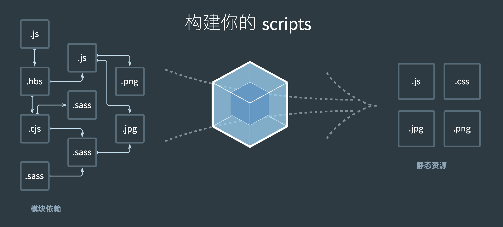

# webpack 总结
* webpack 是前端打包构建的不二选择
* 每日必用，面试必考

## webpack 基本配置
* 拆分配置和 merge
* 启动本地服务
* 处理 ES6、处理样式、处理图片 
* 模块化
## webpack 高级配置
* 多入口
* 抽离 css 文件
* 抽离公共代码
### 一、多入口
```js
// webpack-common.js
module.export = {
  // 配置多入口 entry
  entry: {
    index: path.join(srcPath, 'index.js'),
    other: path.join(srcPath, 'other.js'),
  },
  ...
  plugins: [
    // 多入口 - 生成 index.html
    new HtmlWebpackPlugin({
      template: path.join(srcPath, 'index.html'),
      filename: 'index.html',
      // chunks 表示该页面要引用哪些 chunk （即上面的 index 和 other），默认全部引用
      chunks: ['index'], // 只引用 index.js
    }),
    // 多入口 - 生成 other.html
    new HtmlWebpackPlugin({
      template: path.join(srcPath, 'other.html'),
      filename: 'other.html',
      chunks: ['other'], // 只引用 other.js
    }),
  ],
}
// 无需修改 dev 环境的 webpack 配置
// webpack-prod.js
module.exports = merge(webpackCommonConf, {
  mode: 'production',
  output: {
    filename: '[name].[contenthash:8].js', // name 即多入口时 entry 的 key
    path: distPath,
    // publicPath: 'http://cdn.abc.com'  // 修改所有静态文件 url 的前缀（如 cdn 域名），这里暂时用不到
  }
})
```

### 二、抽离 css 文件
```js
// 示例：common 配置中不含 css 处理，dev 和 prod 中做不同处理
// webpack-dev.js
module.exports = merge(webpackCommonConf, {
  mode: 'development',
  module: {
    rules: [
      {
        test: /\.css$/,
        // loader 的执行顺序是：从后往前
        use: ['style-loader', 'css-loader', 'postcss-loader'], // 加了 postcss
      },
      {
        test: /\.less$/,
        // 增加 'less-loader' ，注意顺序
        use: ['style-loader', 'css-loader', 'less-loader'],
      },
    ],
  },
  ...
});

// webpack-prod.js
const MiniCssExtractPlugin = require('mini-css-extract-plugin');
const TerserJSPlugin = require('terser-webpack-plugin');
const OptimizeCSSAssetsPlugin = require('optimize-css-assets-webpack-plugin');

module.exports = merge(webpackCommonConf, {
  mode: 'production',
  module: {
    rules: [
      // 抽离 css
      {
        test: /\.css$/,
        use: [
          MiniCssExtractPlugin.loader, // 注意，这里不再用 style-loader
          'css-loader',
          'postcss-loader',
        ],
      },
      // 抽离 less
      {
        test: /\.less$/,
        use: [
          MiniCssExtractPlugin.loader, // 注意，这里不再用 style-loader
          'css-loader',
          'less-loader',
          'postcss-loader',
        ],
      },
    ],
  },
  plugins: [
    new CleanWebpackPlugin(), // 会默认清空 output.path 文件夹
    new webpack.DefinePlugin({
      // window.ENV = 'production'
      ENV: JSON.stringify('production'),
    }),

    // 抽离 css 文件
    new MiniCssExtractPlugin({
      filename: 'css/[name].[contenthash:8].css',
    }),
  ],

  optimization: {
    // 压缩 css
    minimizer: [new TerserJSPlugin({}), new OptimizeCSSAssetsPlugin({})],
  },
});
```
### 三、抽离公共代码
```js
// webpack-common.js 中可配置页面要引用哪些 chunk 
// webpack-common.js
module.exports = {
  plugins: [
    // 多入口 - 生成 index.html
    new HtmlWebpackPlugin({
      template: path.join(srcPath, 'index.html'),
      filename: 'index.html',
      // chunks 表示该页面要引用哪些 chunk （即上面的 index 和 other），默认全部引用
      chunks: ['index', 'vendor', 'common'], // 要考虑代码分割
    }),
    // 多入口 - 生成 other.html
    new HtmlWebpackPlugin({
      template: path.join(srcPath, 'other.html'),
      filename: 'other.html',
      chunks: ['other', 'vendor', 'common'], // 考虑代码分割
    }),
  ],
};
// webpack-prod.js
module.exports = merge(webpackCommonConf, {
  mode: 'production',
  optimization: {
    // 分割代码块
    splitChunks: {
      chunks: 'all',
      /**
        initial：入口chunk，对于异步导入的文件不处理
        async：异步chunk，只对异步导入的文件处理
        all：全部chunk
      */
      // 缓存分组
      cacheGroups: {
        // 第三方模块
        vendor: {
          name: 'vendor', // chunk 名称
          priority: 1, // 权限更高，优先抽离
          test: /node_modules/,
          minSize: 0, // 大小限制（根据业务，一般不为0）
          minChunks: 1, // 最少复用过几次
        },

        // 公共的模块
        common: {
          name: 'common', // chunk 名称
          priority: 0, // 优先级
          minSize: 0, // 公共模块的大小限制（根据业务，一般不为0）
          minChunks: 2, // 公共模块最少复用过几次
        },
      },
    },
  },
});
```
## module chunk bundle 的区别
* module（左）：各个源码文件，webpack 中一切皆模块
* chunk（中）：通过 webpack 解析多模块合并而成，如 entry import() splitChunk
* bundle（右）：最终输出的文件



## webpack 性能优化
* 优化打包构建速度 - 开发体验和效率
* 优化产出代码 - 产品性能

### 一、优化打包构建速度
* 优化 babel-loader
* IgnorePlugin
* noParse
* happyPack（按需使用，开启多进程也需要开销）
* ParallelUglifyPlugin（按需使用，开启多进程也需要开销）
* 自动刷新、热更新
* DllPlugin
#### 1.优化 babel-loader
```js
rules: [
  {
    test: /\.js$/,
    loader: ['babel-loader?cacheDirectory'], // 开启缓存
    include: srcPath, // 明确范围
    // exclude: /node_modules/
  },        
]
```
#### 2.IgnorePlugin 避免引用无用模块
```js
// 以 moment.js 语言包为例
// 无需引用 moment 中所有语言包，配置后需手动引用中文包
plugins: [
  // 忽略 moment 下的 /locale 目录
  new webpack.IgnorePlugin(/\.\/locale/, /moment/),
]
```
#### 3.noParse
```js
module: {
  // 忽略对 react.min.js 的文件解析递归处理
  noParse: [/react\.min\.js$/]
}
```
#### 4.happyPack 多进程打包
```js
module: {
  rules: [
    {
      test: /\.js$/,
      // 把对 .js 文件的处理转交给 id 为 babel 的 HappyPack 实例
      use: ['happypack/loader?id=babel'],
      include: srcPath,
      // exclude: /node_modules/
    },
  ]
},
...
plugins: [
  // happyPack 开启多进程打包
  new HappyPack({
    // 用唯一的标识符 id 来代表当前的 HappyPack 是用来处理一类特定的文件
    id: 'babel',
    // 如何处理 .js 文件，用法和 Loader 配置中一样
    loaders: ['babel-loader?cacheDirectory'],
  }),
]
```
#### 5.ParallelUglifyPlugin 多进程压缩
```js
plugins: [
  // 使用 ParallelUglifyPlugin 并行压缩输出的 JS 代码
  new ParallelUglifyPlugin({
    // 传递给 UglifyJS 的参数
    // （还是使用 UglifyJS 压缩，只不过帮助开启了多进程）
    uglifyJS: {
      output: {
        beautify: false, // 最紧凑的输出
        comments: false, // 删除所有的注释
      },
      compress: {
        // 删除所有的 `console` 语句，可以兼容ie浏览器
        drop_console: true,
        // 内嵌定义了但是只用到一次的变量
        collapse_vars: true,
        // 提取出出现多次但是没有定义成变量去引用的静态值
        reduce_vars: true,
      },
    },
  }),
]
```
#### 5.自动刷新、热更新
* 一般使用 webpack dev server 会自动开启自动刷新
```js
// 热更新
module.exports = smart(webpackCommonConf, {
  mode: 'development',
  entry: {
    index: [
      'webpack-dev-server/client?http://localhost:8080/',
      'webpack/hot/dev-server',
      path.join(srcPath, 'index.js'),
    ],
  },
  plugins: [
    new HotModuleReplacementPlugin(),
  ],
  devServer: {
    hot: true,
  }
});
// 增加开启热更新后的代码逻辑
if(module.hot) {
  module.hot.accept(['./index.js'], () => {
    ...
  })
}
```
#### 6.DllPlugin 动态链接库

### 一、优化产出代码
**体积更小；合理分包，不重复加载；执行更快，使用内存更小**
* 小图片用 base64 格式输出
* bundle 加 hash（webpack 高级配置）
* 懒加载（webpack 高级配置）
* 提取公共代码（webpack 高级配置）
* IgnorePlugin（优化打包构建）
* 使用 CDN 加速
* 使用 production
* Scope Hosting
#### 一、图片使用 base64、使用 CDN 加速
```js
output: {
  publicPath: 'http://cdn.abc.com'  // 修改所有静态文件 url 的前缀（如 cdn 域名）
},
module: {
  rules: [
    // 图片 - 考虑 base64 编码的情况
    {
      test: /\.(png|jpg|jpeg|gif)$/,
      use: {
        loader: 'url-loader',
        options: {
          // 小于 5kb 的图片用 base64 格式产出
          // 否则，依然延用 file-loader 的形式，产出 url 格式
           limit: 5 * 1024,
          // 打包到 img 目录下
          outputPath: '/img1/',
          // 设置图片的 cdn 地址（也可以统一在外面的 output 中设置，那将作用于所有静态资源）
          publicPath: 'http://cdn.abc.com'
        },
      },
    },
  ]
}
```
#### 二、使用 production
* 自动开启代码压缩
* Vue React 等会自动删除调试代码（如开发环境的 warning）
* 启动 Tree-Shaking（为使用的代码不会进入打包）
**只有使用 ES6 Module Tree-Shaking 才会生效，CommonJs 不行**
  1. ES6 Module 静态引入，编译时引入
  2. CommonJs 动态引入，执行时引入

#### 三、Scope Hosting
* 代码体积更小
* 创建的函数作用域越少
