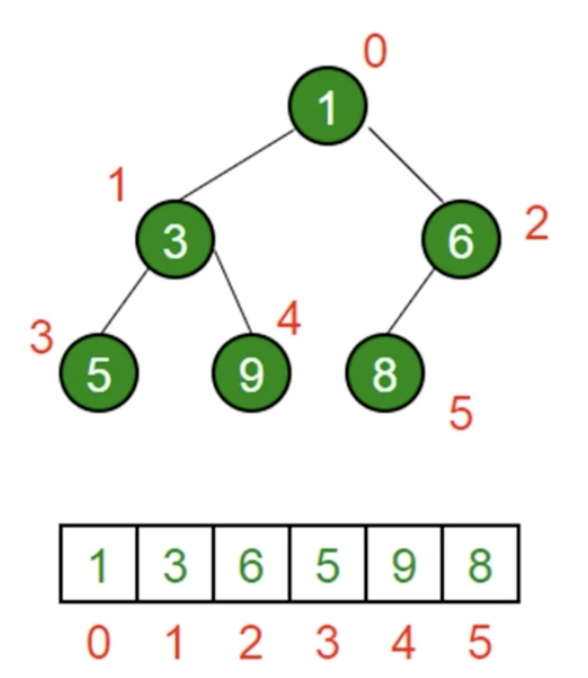

# 堆
## 堆是什么
* 堆是一种特殊的**完全二叉树**
* 所有节点都大于等于（最大堆）或小于等于（最小堆）它的子节点
* js 中通常用数组表示堆
* 左侧子节点的位置是 **2*index+1**
* 右侧子节点的位置是 **2*index+2**
* 父节点的位置是 **(index-1)/2**


## 堆的应用场景
* 高效、快速找出最大值或最小值 
**时间复杂度：O(1)**
* 找出第 K 个最大（小）元素
* 找出第 K 个最大元素算法步骤：
  1. 构建一个最小堆（堆顶为最小元素）
  2. 当容量超过 K，删除堆顶元素
  3. 插入结束后，堆顶就是第 K 个最大元素
## js 实现最小堆类
```js
class MinHeap {
  constructor() {
    this.heap = [];
  }

  // 插入
  // 时间复杂度：O(logK)
  insert(value) {
    // 1. 插入节点到堆尾
    // 2. 上移，将该节点与父节点交换，直到该节点大于父节点
    this.heap.push(value);
    this.shiftUp(this.heap.length - 1);
  }

  // 删除堆顶
  // 时间复杂度：O(logK)
  pop() {
    // 1. 用数组尾部节点替换堆顶（直接删除第一个节点会导致每个节点前移，破坏了整个堆结构）
    // 2. 下移，将新堆顶与子节点交换，直到子节点大于这个新的堆顶
    if (this.size === 1) return this.heap.shift();
    const top = this.heap[0];
    this.heap[0] = this.heap.pop();
    this.shiftDown(0);
    return top;
  }

  // 上移
  shiftUp(index) {
    if (index === 0) return;
    const parentIndex = this.getParentIndex(index);
    if (this.heap[index] < this.heap[parentIndex]) {
      // 若当前节点值小于父节点的值，则需要交换该节点于父节点的位置
      this.swap(index, parentIndex);
      // 递归调用，直到当前节点值大于等于父节点的值
      // 因当前节点于父节点下标已完成交换，所以参数为 parentIndex
      this.shiftUp(parentIndex);
    }
  }
  
  // 下移
  shiftDown(index) {
    const leftIndex = this.getLeftIndex(index);
    const rightIndex = this.getRightIndex(index);
    if (this.heap[leftIndex] < this.heap[index]) {
      this.swap(index, leftIndex);
      this.shiftDown(leftIndex);
    }
    if (this.heap[rightIndex] < this.heap[index]) {
      this.swap(index, rightIndex);
      this.shiftDown(rightIndex);
    }
  }

  // 获取父节点的 index
  getParentIndex(index) {
    // 父节点 index 为当前节点 (index - 1) / 2
    // >> 1，表示二进制运算：右移一位
    return (index - 1) >> 1;
    // 完全等价于：
    // return Math.floor((index - 1) / 2);
  }

  // 获取左侧子节点
  getLeftIndex(index) {
    return 2 * index + 1;
  }

  // 获取右侧子节点
  getRightIndex(index) {
    return 2 * index + 2;
  }

  // 交换节点位置
  swap(i1, i2) {
    const tmp = this.heap[i1];
    this.heap[i1] = this.heap[i2];
    this.heap[i2] = tmp;
  }

  // 获取堆顶
  peek() {
    return this.heap[0];
  }

  // 获取堆大小
  size() {
    return this.heap.length;
  }
}

const h = new MinHeap();
h.insert(3);
h.insert(2);
h.insert(1);
h.heap // [1, 3, 2]
h.pop();
h.heap // [2, 3]
h.peek(); // 3
h.size(); // 2
```

### [leetcode-215.数组中第K个最大元素](https://leetcode.cn/problems/kth-largest-element-in-an-array/)
```js
class MinHeap {
  ...
  // 实现最小堆类
  ...
}
/**
 * @param {number[]} nums
 * @param {number} k
 * @return {number}
 */
var findKthLargest = function (nums, k) {
    const h = new MinHeap();
    nums.forEach(item => {
        h.insert(item);
        if (h.size() > k) {
            h.pop();
        }
    })
    return h.peek();
};
```

### [leetcode-347.前K个高频元素](https://leetcode.cn/problems/top-k-frequent-elements/)
```js
class MinHeap {
  ...
  // 实现最小堆类
  ...
}
/**
 * @param {number[]} nums
 * @param {number} k
 * @return {number[]}
 */
var topKFrequent = function (nums, k) {
    const m = new Map();
    nums.forEach(item => {
        m.set(item, m.has(item) ? m.get(item) + 1 : 1);
    })
    // js 原生排序，时间复杂度O(n log n)
    // const list = Array.from(m).sort((a, b) => b[1] - a[1]).slice(0, k);
    // return list.map(item => item[0]);

    // 最小堆实现，时间复杂度O(log n)
    const h = new MinHeap();
    m.forEach((value, key) => {
        h.insert({ value, key });
        if (h.size() > k) {
            h.pop();
        }
    })
    return h.heap.map(item => item.key)
};
```

### [leetcode-23.合并K个升序链表](https://leetcode.cn/problems/merge-k-sorted-lists/)
```js
class MinHeap {
  ...
  // 实现最小堆类
  ...
}
/**
 * @param {ListNode[]} lists
 * @return {ListNode}
 */
var mergeKLists = function (lists) {
    // 1. 构建最小堆，并把每个链表头插入堆中
    // 2. 弹出堆顶，接入输出链表，并将弹出堆顶所在链表的新链表头插入堆中
    // 3. 堆中元素弹出完，则完成合并
    let res = new ListNode();
    let p = res;
    const h = new MinHeap();
    lists.forEach(list => {
        if (!list) return;
        h.insert(list);
    })
    while (h.size()) {
        const top = h.pop();
        p.next = top;
        p = p.next;
        if (top.next) h.insert(top.next);
    }
    return res.next;
};
```