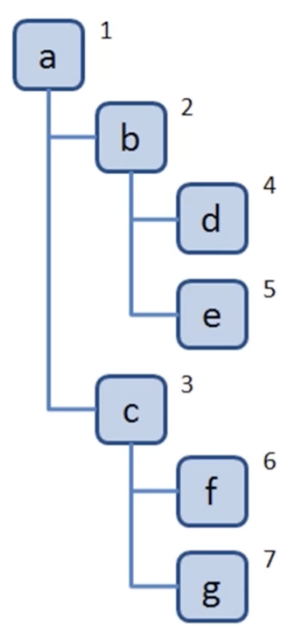
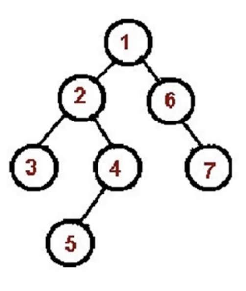
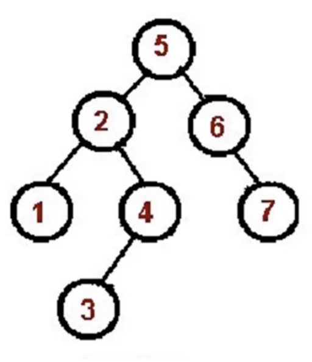
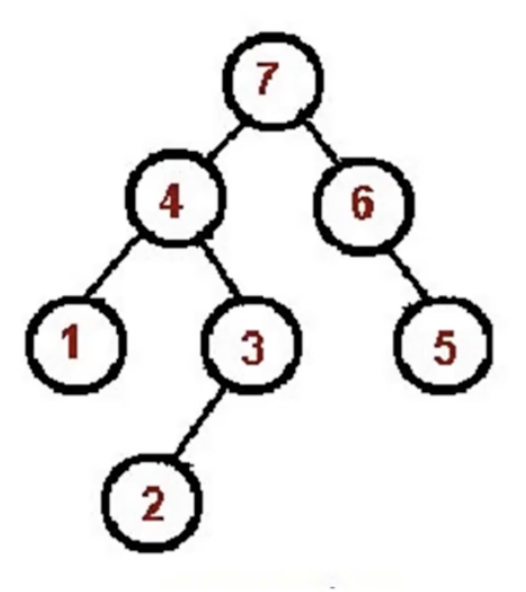

# 树
## 树是什么
* 一种分层数据的抽象模型
* js 中相关的树：DOM 树、树形组件
* js 中没有树数据结构，可以用 Array 和 Object 实现
* 树的常用操作：深度、广度优先遍历，先中后序遍历
## 深度、广度优先遍历
### 一、深度优先遍历
* 尽可能深地搜索树的分支
* 算法步骤：
  1. 访问根节点
  2. 对根节点的 children 依次深度优先遍历


```js
  const tree = {
    val: 'a',
    children: [
      {
        val: 'b',
        children: [
          {
            val: 'd',
            children: []
          },
          {
            val: 'e',
            children: []
          }
        ]
      },
      {
        val: 'c',
        children: [
          {
            val: 'f',
            children: []
          },
          {
            val: 'g',
            children: []
          }
        ]
      }
    ]
  }

  const dfs = (root) => {
    console.log(root);
    root.children.forEach(dfs);
  }

  dfs(tree);
```

### 二、广度优先遍历
* 先访问离根节点最近的节点
* 算法步骤：
  1. 新建一个队列，把根节点入队
  2. 把队头出队，并访问
  3. 把队头的 children 依次入队
  4. 重复 2、3，直到队列为空


```js
const bfs = (root) => {
  const q = [root];
  while (q.length) {
    const top = q.shift();
    console.log(top);
    top.children.forEach(item => q.push(item))
  }
}

bfs(tree);
```

## 二叉树先中后序遍历
### 一、先序遍历
* 算法步骤：
  1. 访问根节点
  2. 对根节点的左子树先序遍历
  2. 对根节点的右子树先序遍历


```js
const binaryTree = {
  val: 1,
  left: {
    val: 2,
    left: { val: 4, left: null, right: null },
    right: { val: 5, left: null, right: null },
  },
  right: {
    val: 3,
    left: { val: 6, left: null, right: null },
    right: { val: 7, left: null, right: null },
  }
}

// 递归实现
const preorder = (root) => {
  if (!root) return;
  console.log(root);
  preorder(root.left);
  preorder(root.right);
}

preorder(binaryTree);

// 栈实现
const stackPreorder = (root) => {
  if (!root) return;
  const stack = [root];
  while (stack.length) {
    const top = stack.pop();
    console.log(top);
    if (top.right) stack.push(top.right);
    if (top.left) stack.push(top.left);
  }
}

stackPreorder(binaryTree);
```
### 二、中序遍历
* 算法步骤：
  1. 对根节点的左子树中序遍历
  2. 访问根节点
  3. 对根节点的右子树中序遍历


```js
// 递归实现
const inorder = (root) => {
  if (!root) return;
  inorder(root.left);
  console.log(root);
  inorder(root.right);
}

inorder(binaryTree);

// 栈实现
const stackInorder = (root) => {
  if (!root) return;
  const stack = [];
  let p = root;
  while (stack.length || p) {
    while (p) {
      stack.push(p);
      p = p.left;
    }
    const top = stack.pop();
    console.log(top);
    p = top.right;
  }
}

stackInorder(binaryTree);
```
### 三、后序遍历
* 算法步骤：
  1. 对根节点的左子树后序遍历
  2. 对根节点的右子树后序遍历
  3. 访问根节点


```js
// 递归实现
const postorder = (root) => {
  if (!root) return;
  postorder(root.left);
  postorder(root.right);
  console.log(root);
}

postorder(binaryTree);

// 栈实现
const stackPostorder = (root) => {
  if (!root) return;
  const stack = [root];
  const outputStack = [];
  while (stack.length) {
    const top = stack.pop();
    outputStack.push(top);
    if (top.left) stack.push(top.left);
    if (top.right) stack.push(top.right);
  }
  while (outputStack.length) {
    const output = outputStack.pop();
    console.log(output);
  }
}

stackPostorder(binaryTree);
```
## 前端遍历 json 所有节点值
```js
const json = {
  a: {b: { c: 1 } },
  d: [1, 2]
}

const dfs = (n, path) => {
  console.log(n, path);
  Object.keys(n).forEach(k => {
    dfs(n[k], path.concat(k));
  });
}

dfs(json, []);
```

### [leetcode-104.二叉树最大深度](https://leetcode.cn/problems/maximum-depth-of-binary-tree/)

### [leetcode-111.二叉树最小深度](https://leetcode.cn/problems/minimum-depth-of-binary-tree/)

### [leetcode-102.二叉树的层序遍历](https://leetcode.cn/problems/binary-tree-level-order-traversal/)

### [leetcode-94.二叉树的中序遍历](https://leetcode.cn/problems/binary-tree-inorder-traversal/)

### [leetcode-112.路径总和](https://leetcode.cn/problems/path-sum/)